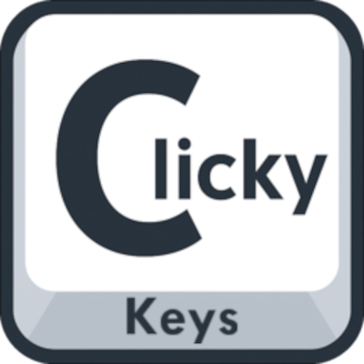
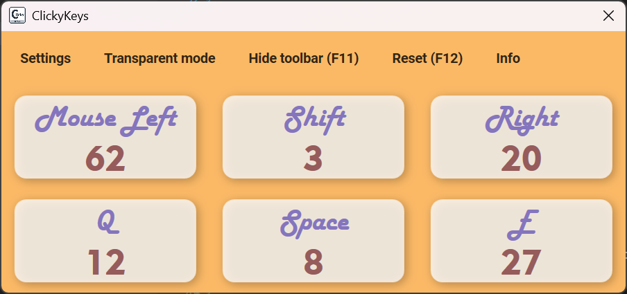
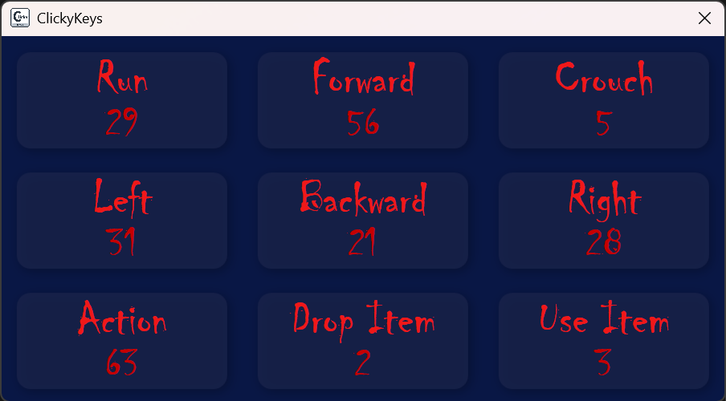
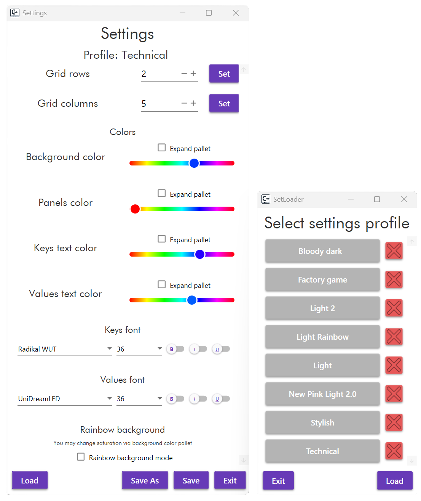
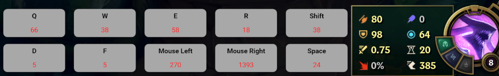



 

# ClickyKeys

<h3>
A small hobby project for gamers and geeks who love tracking their keypresses and clicks.  

The program counts how many times you press chosen keys or mouse buttons and displays them in a customizable panel. 
 

  <picture>
      
  </picture>

## ✨ Features  
<h4>

- Count presses for any keys you want (keyboard + mouse).   
  

   
  <picture>
    
  </picture>
  

 

- Fully customizable panel:  
  - Choose which keys to display.  
  - Adjust button layout.  
  - Change text and background colors.  
  - Select your favorite font.  
  - Save your profiles for later.

## 💾 Save your profiles for later
<h4>
Swap your profiles just by one click. Game accurate sets are now always ready in your library.

 

  <picture>
    
  </picture>

## 🌈 Are You bored with single color static background? 
<h4>
Try rainbow background theme and bring more color to your screen.

 

  <picture>
      
  </picture>

## 🏪 Now in Microsoft Store
<h4>
We are officially verified and available on Microsoft Store. Download on your Windows just by one click.

<h3>

[ Clicky Keys - Microsoft Store  ](https://apps.microsoft.com/store/detail/9PJT83WPC06K?cid=DevShareMCLPCS)

## 🎬 OBS  
<h4>
In case you record video or stream ClickyKeys works great with OBS — you can easily 
chroma key the background for clean overlays in streams or recordings.

 

  <picture>
      
  </picture>

## 🛠 Usage  
<h4>

1. Run the program.

2. Choose the keys you want to track - click on panel and choose your key and description.
3. Smash your keyboard (or click around) and see the counters go up!
4. Reset stats anytime with **F12**.  

## 💡 Why?  
<h4>
Because pressing buttons is fun, and sometimes you just want to know how much.  

A small side project made for simple geeky satisfaction.  

## 🔧 Planned / Ideas  
- Statistic 📊