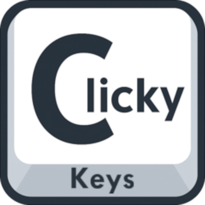
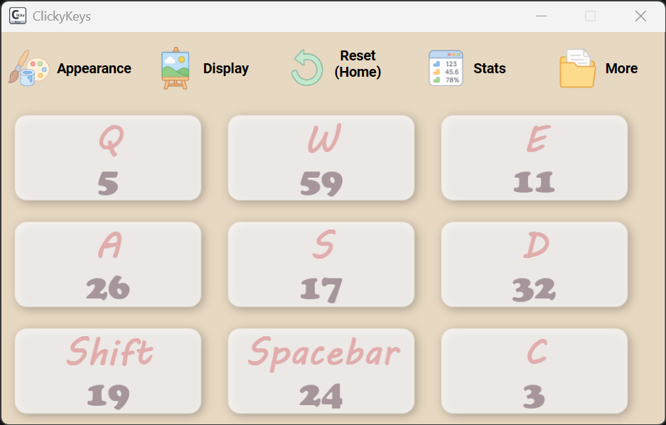
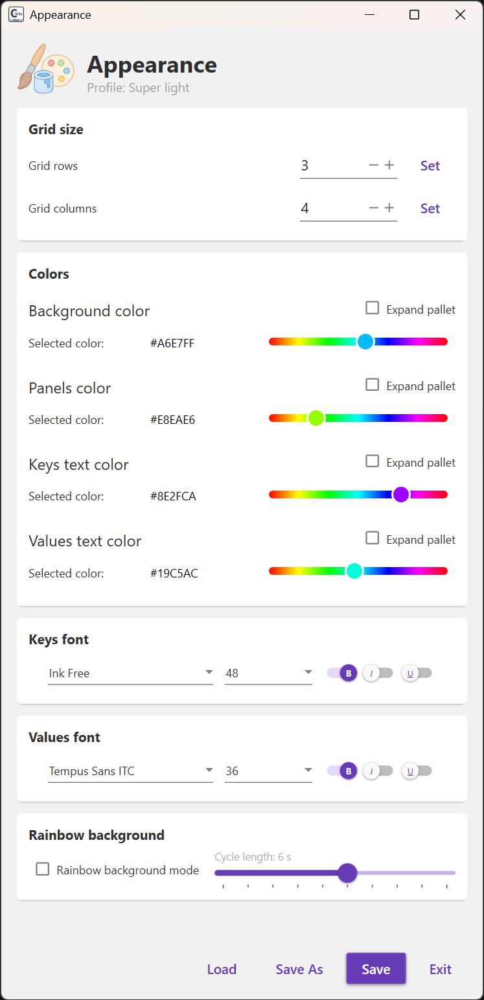
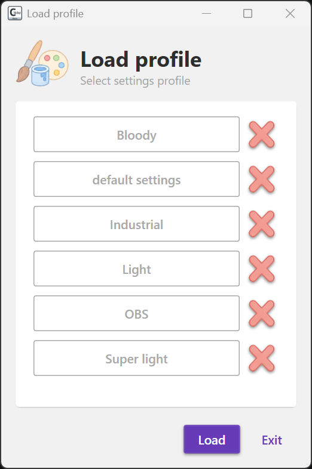
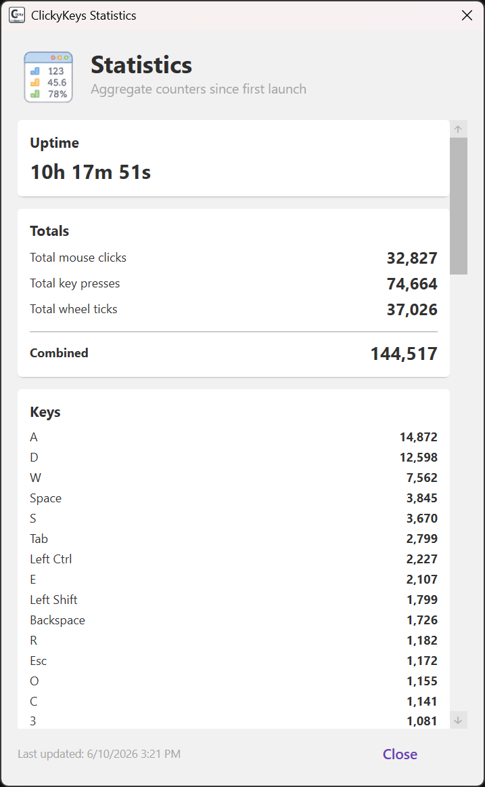
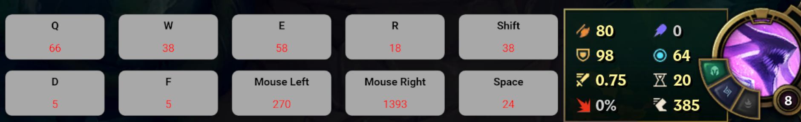
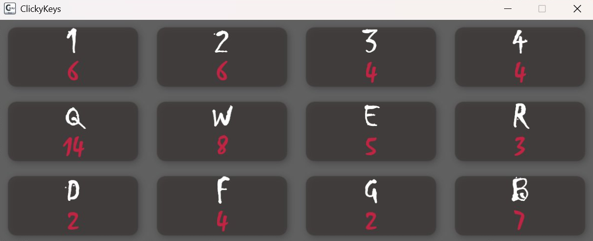
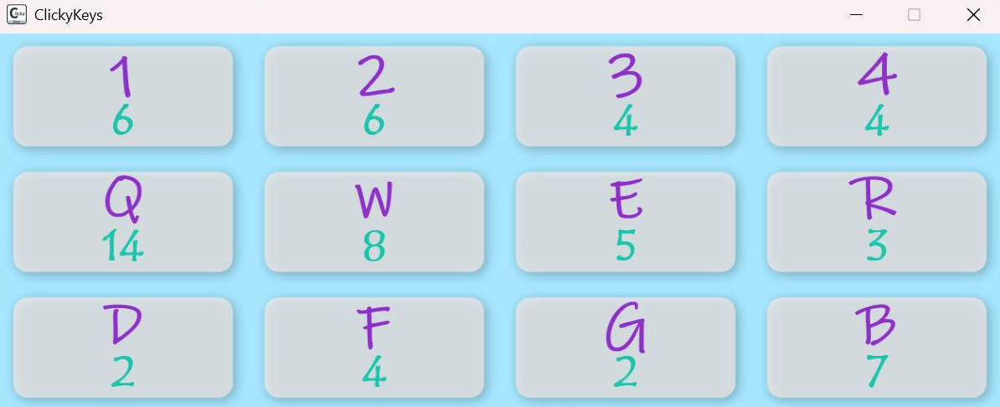
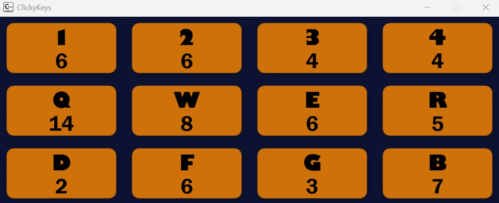



 

# ClickyKeys

**A free, open-source key press and click counter for gamers and streamers.**

<h3>

ClickyKeys counts how many times you press chosen keys or mouse buttons and displays them in a customizable panel — perfect for streams, recordings, and geeky satisfaction.

 

  <picture>
      
  </picture>

---

## ✨ Features

<h4>

**🎯 Count any key or mouse button**
- Pick exactly which keys and mouse buttons to track.
- Give each key its own custom label (e.g. *Jump*, *Reload*, *LMB*).
- Counters update in real time.

 

 

**🎨 Fully customizable panel**

- Choose which keys to display.
- Adjust button size and grid layout.
- Change text and background colors.
- Select your favourite font and size.

 

 

**🌍 Available in 13 languages**

---

## 💾 Save & load style profiles

Swap profiles with a single click. Game-specific sets are always ready in your library.

 

  <picture>
  
    
  </picture>

---

## 🌈 Rainbow theme

Bored with a static background? Enable the animated rainbow theme and bring more colour to your stream.

 

  <picture>
      
  </picture>

---

## 📊 Local key press statistics

Track your long-term key usage with built-in local statistics. All data stays on your device — no cloud, no account needed.

 

  <picture>
      <!-- Add screenshot: ./Resources/Images/screenshot-stats.png -->
      
  </picture>

 

---

## 🏪 Available on Microsoft Store & GitHub

<h3>

[ Microsoft Store — one-click install](https://apps.microsoft.com/store/detail/9PJT83WPC06K?cid=DevShareMCLPCS)

[ GitHub Releases — portable version, no install needed](https://github.com/Reksaku/ClickyKeys/releases/latest)

> ###### If Windows SmartScreen flags the portable file, click **More info → Run anyway**. This is a common false positive for small unsigned C# apps — the full source code is available here on GitHub.

---

## 🎬 OBS integration

ClickyKeys works great with OBS. You can either:
- Use **chroma key** on the background colour for a clean transparent overlay, or
- Enable **transparent mode** to overlay the panel directly without chroma key.

 

  <picture>
      
  </picture>

---

## 🖼 Screenshots

Colors, fonts, grid layout — everything is yours to configure.

| Dark | Blue | Orange |
|------|------|--------|
|  |  |  |

<!-- Add screenshots to ./Resources/Images/ — originals available at https://clickykeys.fun -->

---

## 🛠 Usage

1. Download and run ClickyKeys (Microsoft Store or GitHub Releases).
2. Click the panel and choose the keys you want to track.
3. Set a custom label for each button (e.g. *Jump*, *Reload*).
4. Smash your keyboard (or click around) and watch the counters go up!
5. Reset all counters anytime with **F12**.
6. *(Optional)* In OBS, add a Window Capture source for the panel and use chroma key or transparent mode.

---

## 📋 What's new

| Version | Highlights |
|---------|-----------|
| **v2.4.1** | Gamepad support, collapsible cards, panel profiles and more |
| **v2.4.0** | Version 2.4.0 is the largest update in a while - see release notes |
| **v2.3.0** | Local key press statistics — track long-term usage, all data stored on-device |
| **v2.2.1** | Save & load style profiles — switch configurations instantly between games |
| **v2.1.1** | Auto-update notifications — the app notifies you when a new version is out |
| **v2.1.0** | Rainbow theme & font customization — animated background + font family/size control |
| **v2.0.0** | Full rewrite in WPF — better performance, stability, and a modern interface |

---

## ❓ FAQ

**Does ClickyKeys store or send my data?**

ClickyKeys works entirely offline — no data is transmitted anywhere. Local statistics stay on your device only.

---
**Which systems are supported?**

Windows (desktop app). If you want to help with ports to other systems, reach out via GitHub Issues.

---
**Is ClickyKeys free?**

Yes — ClickyKeys is completely free.

---
**How do I use it with OBS?**

Run ClickyKeys and select the keys to track. In OBS, add a Window Capture source pointing to the ClickyKeys panel. Use the built-in background colour for chroma key, or enable transparent mode to overlay directly.

---
**I found a bug or have a feature idea.**

Open an issue in this repository — feedback is always welcome!

---

## 💡 Why?

Because pressing buttons is fun, and sometimes you just want to know how many times you did it.

A side project made for simple geeky satisfaction.

---

## 📄 License

ClickyKeys is **source-available** software, licensed under the [Elastic License 2.0 (ELv2)](https://github.com/Reksaku/ClickyKeys/blob/main/LICENSE).

The source code is publicly visible and you are free to use, modify, and self-host ClickyKeys. Commercial use — including reselling or offering it as a managed service — requires a separate agreement.

> ⚠️ ELv2 is not an open source license as defined by the [Open Source Initiative](https://opensource.org). If you have questions about permitted use, see the [full license text](LICENSE) or open an issue.

---

## 🤝 Contributing

Contributions are welcome! Before submitting a pull request, please sign the [Contributor License Agreement](https://cla-assistant.io/Reksaku/ClickyKeys). This allows ClickyKeys to be sustainably developed while keeping the source visible to everyone.