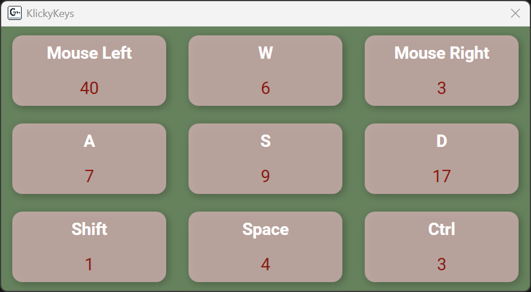

# ClickyKeys 🎮⌨️  

A small hobby project for gamers and geeks who love tracking their keypresses and clicks.  
The program counts how many times you press chosen keys or mouse buttons and displays them in a customizable panel. 

  <picture>
      
  </picture>

## ✨ Features  
- Count presses for any keys you want (keyboard + mouse).  
- Fully customizable panel:  
  - Choose which keys to display.  
  - Adjust button size and layout.  
  - Change text and background colors.  

  <picture>
      
      
  </picture>

## 🎬 OBS  
In case you record video or stream ClickyKeys works great with OBS — you can easily chroma key the background for clean overlays in streams or recordings.

  <picture>
      
  </picture>

## 🛠 Usage  
1. Run the program.  
2. Choose the keys you want to track - click on panel and choose your key and description.  
3. Smash your keyboard (or click around) and see the counters go up!  
4. Reset stats anytime with **F12**.  

## 💡 Why?  
Because pressing buttons is fun, and sometimes you just want to know how much.  
A small side project made for simple geeky satisfaction.  

## 🔧 Planned / Ideas  
- More styling options (fonts, themes).